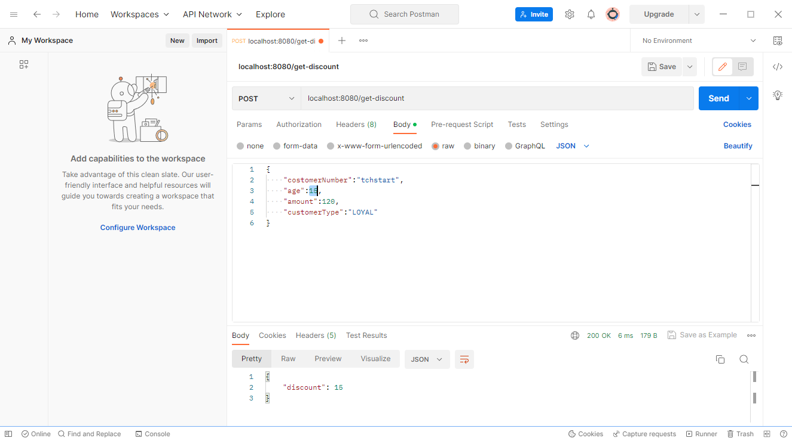

# 规则引擎Drools
规则引擎实现了将业务决策从应用程序代码中分离出来，接收数据输入，解释业务规则，并根据业务规则做出业务决策。规则引擎其实就是一个输入输出平台。

系统中引入规则引擎后，业务规则不再以程序代码的形式驻留在系统中，取而代之的是处理规则的规则引擎，业务规则存储在规则库中，完全独立于程序。业务人员可以像管理数据一样对业务规则进行管理，比如查询、添加、更新、统计、提交业务规则等。业务规则被加载到规则引擎中供应用系统调用。

有的时候代码里有很多if...else if...，导致代码非常耦合，为了解决这样问题：
1.采取策略模式

```java
import org.springframework.beans.factory.annotation.Autowired;

// 策略类
public class Strategy {
    public void AlgorithmInterface();
}

//具体策略类，封装了具体的算法或行为，继承Strategy
public class ConcretaStrategyA extends Strategy {
    public void AlgorithmInterface() {
        //....
    }
}

public class ConcretaStrategyB extends Strategy {
    public void AlgorithmInterface() {
        //....
    }
}

public class Context {
    @Autowired
    public Strategy strategy;
    
    public Context(Strategy strategy){ this.strategy = strategy; }
    
    public void doservice(){strategy.AlgorithmInterface();}
}

public class main{
    public static void main(String[] args) {
        Strategy strategya = new ConcretaStrategyA();
        Context context = new Context(strategya);
        context.doservice();
    }
}
```
2.整合规则引擎Drools
`见案例`


案例测试：
